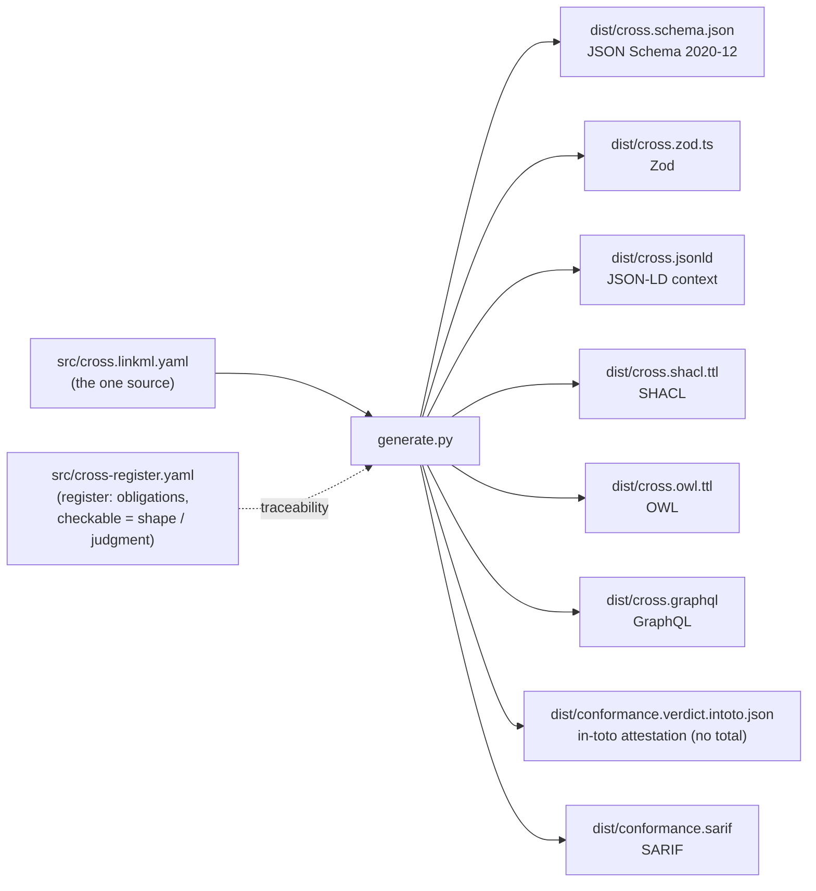

# CROSS, machine-readable (conformance layer)

Machine-readable conformance artifacts for the CROSS standard (`CROSS-common-reporting-outcome-standards-schema`, internal v0.5.7, CC0), the grants domain application of CRAFT. Every artifact here is **generated from one source**, never hand-edited, so the schema an agent validates against cannot drift from the standard.

If you only want the file to validate against, it is [`dist/cross.schema.json`](dist/cross.schema.json) (JSON Schema 2020-12) or [`dist/cross.zod.ts`](dist/cross.zod.ts) (Zod). For why this exists, see [EXPLAINER.md](EXPLAINER.md).

Without an operational definition, a claimed indicator is a name, not a measurement instrument.

## This is the conformance layer, not the serialization layer

This directory answers "is this a well-formed CROSS conformance object", the validation question. It is distinct from and complementary to the repository's [`schemas/`](../schemas/) directory, which is the serialization and interop layer: the JSON Schema family (round-config, runbook, applicant-facing-publication) for moving round data into and out of CROSS so third-party implementers can build tooling. The two answer different questions and neither supersedes the other. This layer is generated from one source; the `schemas/` family is currently hand-authored.

## The pipeline



One LinkML model generates the schema and semantic tier; thin adapters in `generate.py` carry what LinkML does not (pin the JSON Schema draft and the `$id`, coerce the boolean-discriminated conditionals so the Part V rules actually fire, close the top-level schema; emit Zod from the dereferenced schema; project the indicator profile to in-toto and SARIF). The register (`src/cross-register.yaml`) marks each of CROSS's obligations as **shape** (a schema can enforce it), **judgment** (a reader must assess it), or **mixed**.

## The object

The tree-root object is an `IndicatorSpecification`: the self-specified outcome indicator CROSS requires of every applicant (Part V), the conformance-bearing measurement unit of a grant round and CROSS's realization of CRAFT Condition 4. It carries the indicator name, the rationale, the measurement form classified on three axes (source type, measurement form, aggregation type), the operational definition (meeting WALKRI Part III, the field-level composition point with WALKRI), the construction methodology, the data source, the baseline and target, and, where activated, the sustainability plan. Three conditional obligations are enforced: a contract-centric indicator must name its execution and verification instruments, a change or retroactive indicator must carry a baseline, and an applicant-controlled data source must name independent corroboration.

## What each artifact is, and who consumes it

| Artifact | Format | Consumer |
|---|---|---|
| `dist/cross.schema.json` | JSON Schema 2020-12 | any validator; the canonical contract |
| `dist/cross.zod.ts` | Zod / TypeScript | runtime validation in a TS pipeline; a source of truth for agents |
| `dist/cross.jsonld` | JSON-LD context | linked-data / graph ingestion |
| `dist/cross.shacl.ttl` | SHACL shapes | validating CROSS indicator data expressed as RDF |
| `dist/cross.owl.ttl` | OWL | ontology alignment |
| `dist/cross.graphql` | GraphQL SDL | schema-first APIs / indexers |
| `dist/conformance.verdict.intoto.json` | in-toto Statement | an indicator profile and the state of its conditional obligations, with **no aggregate score** |
| `dist/conformance.sarif` | SARIF 2.1.0 | a findings run: one result per required field group |

## Regenerate

```
python -m venv venv && ./venv/bin/pip install -r requirements.txt
./venv/bin/python generate.py        # regenerate dist/ from src/
./venv/bin/python tests/validate.py  # the conformant example validates; the non-conformant ones must fail
```

`tests/validate.py` runs against the generated JSON Schema with a standard validator (the conditional obligations are enforced there, not through LinkML), and every non-conformant fixture in `examples/` must fail: a missing operational definition, a contract-centric indicator with no verification instruments, a change indicator with no baseline, and an applicant-controlled source with no independent corroboration. That is the guard against a silently-broken schema.

## Provenance

Generated from the CROSS standard, `github.com/CrossWalkri/cross` (`CROSS-common-reporting-outcome-standards-schema-0_2_0.md`, internal version 0.5.7). CROSS is the grants domain application of CRAFT (it inherits CRAFT's chain-framing conditions, Part XIII) and composes with WALKRI at the field level (CROSS uses WALKRI; it does not inherit from it). Specification CC0 1.0.
