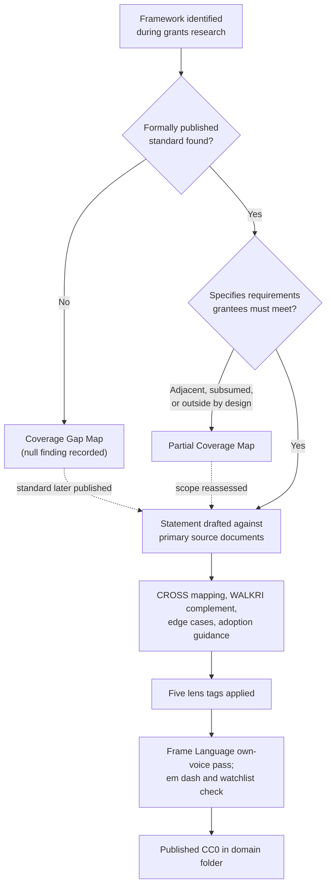

# Compatibility Statements

This directory holds the CROSS+WALKRI compatibility corpus: published analyses of how named external grant, evaluation, and reporting frameworks relate to CROSS and WALKRI. Each statement takes one external framework, reads its primary published documents, and sets out where the two architectures meet, where one supplies what the other leaves unspecified, and where the alignment has limits.

Everything here is CC0.

## What a compatibility statement is

CROSS is the grants domain standard covering obligation architecture: what a funded intervention must demonstrate, at which gate, and on what evidence. WALKRI is the per-axis instrument-quality standard covering the fields through which that evidence is collected. Both are format-agnostic. A compatibility statement is the document that connects one of them, or both, to an external framework a program is already answerable to.

The CROSS specification carries this coverage as Part XII, *Institutional Framework Alignment*. This directory is the expanded form of that part: one file per framework rather than one section per framework, so that a program working under a single external standard can cite a single document.

A statement is an analysis, not a countersigned agreement. It is written against the framework's published documents, which are listed in each file's `references` frontmatter, and it argues its own case where the framework's self-presentation makes the mapping contestable. The GiveWell statement is the clearest instance: GiveWell presents its methodology as donor-facing decision support rather than as a grantee measurement standard, and the statement sets out a four-part argument for treating it as grantee-facing in the operational sense before proceeding on that basis. Where a statement makes a move like that, it says so in the text.

The relationship a statement records is not always the same relationship. Three kinds recur:

- **Satisfaction.** A CROSS-conformant round produces what the external framework requires. The LIHEAP statement works this way: three statutory performance measures, fixed in advance by legislation, map onto the entry specification gate and the completion gate.
- **Complementarity.** The two operate at different layers and neither subsumes the other. The AAOIFI statement records that AAOIFI's Zakat and Waqf standards specify the accounting treatment and institutional conduct conditions for charitable capital, and explicitly leave program outcome measurement to implementing organizations, which is the layer CROSS occupies.
- **Consumption.** The external framework takes CROSS+WALKRI output as input. The IATI statement maps CROSS round configurations and indicator data onto the IATI Activity Standard and notes that IATI consumes what CROSS and WALKRI produce while CROSS and WALKRI do not depend on IATI.

Reading a statement as a blanket claim of equivalence in either direction misreads it. Each one names its own relationship in the opening summary.

## What is in the corpus

The directory holds 141 markdown files: 138 compatibility statements across ten domain folders, and three reference documents in `meta/`.

| Domain folder | Statements |
|:--|--:|
| `international-development/` | 36 |
| `philanthropy/` | 32 |
| `evaluation-research/` | 16 |
| `governance-fiscal/` | 12 |
| `web3/` | 12 |
| `corporate-impact/` | 10 |
| `health/` | 7 |
| `education-workforce/` | 6 |
| `environment-climate/` | 4 |
| `human-services/` | 3 |
| **Total** | **138** |

That is a file count, and it is not the same as a count of frameworks covered. It runs high in places, because a superseded statement is retained alongside its replacement, and Optimism Retro Funding holds three files covering one program family. It runs low in others, because a single file can cover more than one framework, as the joint COPE and IDEAS statement does. Counts of frameworks stated elsewhere in the repository are separate countings taken at earlier dates against the CROSS specification's own Part XII rather than against this directory, and they will not reconcile to 138 by arithmetic.

Four of the 138 address WALKRI alone, with no CROSS mapping, because the external framework operates purely at the instrument and disclosure layer: SROI, the Gates Foundation open access policy, research funder data management plan standards, and Open Source Observer.

The three documents in `meta/` are not compatibility statements. The coverage gap map records frameworks searched and not found. The partial coverage map records frameworks found but structurally outside Part XII. The attestation landscape maps the verification mechanisms available to a program implementing CROSS+WALKRI, without prescribing one.

## What was analysed, and why these frameworks

Inclusion turns on a publication test, stated in the coverage gap map and applied across the corpus. A framework qualifies when its controlling document is publicly accessible at a stable URL, specifies requirements that grant programs or grantees must meet, and is one of three things: a regulatory instrument, a formal standard with declared decision-standing rules and named maintainers, or a widely adopted sector-reference framework.

Practice descriptions, job postings, internal policy summaries, annual reports, and eligibility criteria alone do not qualify. This is why several of the most sophisticated evaluators in philanthropy appear in the gap map rather than here: the test is whether a prescriptive standard was published, not whether the organization does serious work.

The spread across domains is deliberate rather than opportunistic. The research behind the corpus reads onchain and web3 funding, private foundations, United States federal funders, development banks, bilateral and United Nations aid, global health funds, research councils, evaluation and results standards, impact certification, and philanthropy practice models in the same terms. Reading across all of them at once is what made the shared structure visible; the research record is explicit that no single funding tradition could see it from inside.

## How a statement gets made

A framework enters the pipeline through targeted search during the grants research, then sorts into one of three registers. The sort is the load-bearing step, because putting a partial finding in with the true nulls would misrepresent organizations that published something real in an adjacent scope, or that operate without measurement frameworks by design.

The dotted returns are live, not decorative. Eleven entries moved out of the gap map into Part XII in one revision, including the Sovereign Tech Fund, NLnet Foundation, Open Technology Fund, and the Te Puni Kokiri Effectiveness for Maori Framework; four more moved in a later one, including the Johns Hopkins opioid litigation principles and Candid Seals of Transparency. Movement runs the other way too: a batch of entries was reclassified out of the gap map into the partial coverage map once the distinction between null and partial was drawn. Both maps are maintained as living records, and both carry changelogs recording what moved and why.

### Anatomy of a statement

Statements share a spine rather than a rigid template. Almost all carry a summary, a section describing what the external framework is in its own terms, a section on how CROSS satisfies or relates to it, a section on how WALKRI complements the alignment, and a changelog. Most carry a mapping table putting external provisions and CROSS or WALKRI mechanisms side by side. Many carry adoption guidance for programs already operating under the external framework, and edge cases where the mapping needs explicit handling.

The mapping tables are the part a practitioner uses first. They are written to be checkable in both directions, including the negative cells: the Hypercerts and IATI tables both list rows where the external framework has no equivalent for a CROSS field, which is how the statement shows what conformance adds rather than only what it satisfies.

Every statement carries `standards` frontmatter naming the CROSS and WALKRI versions it was written against, and `references` listing the primary sources read. These versions vary across the corpus, because statements were written against the specification as it stood.

### Lens tags

All 138 statements carry the same five-dimension classification in frontmatter, specified by the CROSS+WALKRI Lenses Framework. Lenses sit above the primitive layer and exist to make cross-cutting questions answerable across the corpus rather than one file at a time.

- **`calibration_tier`**: the depth of measurement rigor the framework imposes, on a five-tier graduation from impressionistic, through process conformant, outcome specified and self-reported, and independently verified, to falsifiable. An organization moves up by adding, not by switching methodology.
- **`authority_source`**: where the framework's binding force comes from. Statutory, regulatory, contractual, voluntary published, civil-society advisory, or professional-society standard.
- **`framework_scope_type`**: what kind of object the framework is. Grantee outcome measurement, allocator process, third-party rating, certification, professional practice and ethics, government accountability, accounting or financial reporting, or jurisprudential.
- **`cultural_methodological_lineage`**: the tradition the framework descends from, which makes visible that compatibility means structurally different things across lineages.
- **`funder_typology`**: the kind of funder the framework serves.

Each lens value carries detection criteria in the Lenses Framework, so a reader can check a tag rather than take it. The tags also record their own uncertainty: a handful of statements carry a composite value rather than a single enumerated one, because the framework operates at different tiers at different layers, and at least one carries an explicit flag that the value needs author review.

## What the corpus found

The finding that survives across the whole corpus is convergence. Structurally identical mechanisms recur in institutions that did not learn them from each other, and the later research waves mostly confirmed rather than expanded what the earlier ones had found. Five recurrences are the strongest:

- **Performance-conditioned disbursement**, where the next period's amount is set by demonstrated performance rather than by a pre-committed schedule, in three unrelated institutional contexts: the Global Fund's periodic update and disbursement request mechanism, ARPA-H milestone payments, and the Millennium Challenge Corporation's economic rate of return gate.
- **Disaggregation persistence**, the constraint that categories established at entry are maintained through completion, in seven frameworks: USAID PIRS, OECD DAC, the DCED Standard, CGIAR MELIA, IFAD core outcome indicators, the Global Fund, and What Works Cities. This is the widest recurrence of any structural concept in the corpus.
- **Criterion specification completeness**, the five-element structure of intent, operational definition, measurement type, evidence source, and conformance threshold, in four independent frameworks. USAID PIRS matches it essentially name for name.
- **Qualitative mechanism inquiry**, the requirement to investigate why changes occurred and not only whether they did, in three independent institutional evaluation standards: the DCED Standard, OECD DAC evaluation criteria, and CGIAR MELIA.
- **Safe feedback infrastructure**, a standing independently accessible complaint channel with investigation and response obligations, in three unrelated humanitarian frameworks: Core Humanitarian Standard Commitment 5, World Vision LEAP, and the CRS feedback mechanism guide.

Convergence of this kind is read as evidence rather than as a shortfall. A wide study narrowing onto a small set of recurring structures is what a real basis looks like; a study that keeps producing structurally new mechanisms has not found one yet. The corpus is the evidence base against which that basis has to be reconstructable.

The distinctiveness claim the corpus supports is a union, and it is worth stating precisely because the stronger-sounding version does not survive scrutiny. Cross-sector funding standards already exist as transactional reporting: IATI spans government aid, development banks, and foundations in one schema. Web3-native grant program decomposition already exists: DAOIP-5 breaks grant programs into reusable components. What no prior work does is both at once, a structural decomposition holding across web3, philanthropy, development finance, federal, multilateral, and research funding as a single reusable basis. The claim is stated against IATI and DAOIP-5 by name rather than as an unqualified first. One check remains owed on it: the prior-work search that established the gap was weighted toward United States sources, and a deeper scan of non-United-States grey literature would strengthen or qualify it.

## What the coverage gap map records

`meta/CROSS-WALKRI-coverage-gap-map-0_1_0.md` records every major giving tradition, foundation, bilateral agency, philanthropic body, and grant evaluation framework researched during the corpus's development for which no formally published standard was found. It is a register of null findings, organized by category, with each entry naming what was found and why it fell short of the threshold.

Null findings are recorded for three reasons. They show that coverage claims rest on research rather than assertion, and that an absence of coverage reflects an absence of published material rather than an incomplete search. They map real gaps in the grants ecosystem's standards infrastructure, naming contexts where grantees, reviewers, operators, and funders work without a shared measurement framework. And the pattern of absences is itself an argument for a universal standard.

The map distinguishes three kinds of absence, and the distinction matters for anyone reading it as an opportunity list.

The first is measurement that happens but is not codified. Many major foundations and bilateral agencies conduct serious evaluation work and have not published it as a standard others can adopt. The pattern across named United States foundations is consistent: sophisticated internal evaluation, commissioned external evaluators for major programs, narrative and financial reporting required from grantees, and no published prescriptive methodology. The exceptions that do publish, including the W.K. Kellogg Foundation, the Annie E. Casey Foundation, and the Robert Wood Johnson Foundation, are notable precisely because they are exceptions.

The second is cultural giving traditions without administrative infrastructure. Several traditions predate formal measurement frameworks and operate without them by design. The gap map records that they exist and that no incompatible published standard was found, and takes no position on whether they should adopt one.

The third is a genuine ecosystem gap, where a standard should exist and does not. The absence of a pan-African philanthropic measurement standard and of a unified Latin American grant evaluation framework fall here. So does settlement-funded grantmaking, where tens of billions of United States dollars are distributed under heterogeneous state-level rules with no shared measurement architecture.

The map is maintained rather than frozen. Where an organization listed in it publishes a formal standard, the intended response is a compatibility statement and an updated entry.

Its companion, `meta/CROSS-WALKRI-partial-coverage-map-0_1_0.md`, holds the cases that are neither full coverage nor true nulls, sorted into five categories: frameworks adjacent to grantee outcome measurement such as peer review methodologies and charity ratings, intentional non-adoption, historical and inactive programs, cultural and religious traditions, and coverage subsumed by a framework already covered here.

## Using the corpus

If you operate a grants program under a named external framework, look for that framework in the domain folder matching its sector, read the summary and the mapping table first, and read the edge cases before assuming the mapping is clean. If your framework is not here, check both maps in `meta/` before concluding it was missed: it may be a recorded null or a recorded partial, with the reason stated.

If you are classifying a framework that appears in none of the three registers, the lens vocabulary above is the fastest route to placing it, and the CROSS+WALKRI primitives framework index maps measurement primitives to their strongest framework exemplars, which supports classification without writing a full statement.

## Limits

Three limits apply to the corpus as a whole and are worth knowing before citing it.

Coverage is uneven by design and by history. International development and philanthropy hold half the corpus between them; human services, environment and climate, and education and workforce hold thirteen statements combined. That reflects where published standards are dense, and also where the research waves went first.

The statements are written against specific versions of CROSS and WALKRI, and those versions differ across files. A statement written against an earlier specification version has not necessarily been re-derived against the current one, and its `standards` frontmatter is the honest record of what it was checked against.

Compatibility is a structural finding, not an endorsement, a certification, or a legal opinion. Nothing in a statement commits the external framework's publisher to anything, and a program that needs the external body's own confirmation of conformance will need to obtain it from that body.

---

*Published under CC0. For the current version of CROSS and WALKRI, see github.com/CrossWalkri.*

## Changelog

| Version | Date | Summary |
|---|---|---|
| 0.1.0 | 2026-07-27 | Initial directory README. Documents what a compatibility statement is and the three relationship types it can record, the corpus contents and per-domain counts, the publication threshold for inclusion, the three-register pipeline and statement anatomy, the five corpus lenses, the cross-framework recurrence findings and the union distinctiveness claim, what the coverage gap map and partial coverage map record, and the corpus-level limits. |
